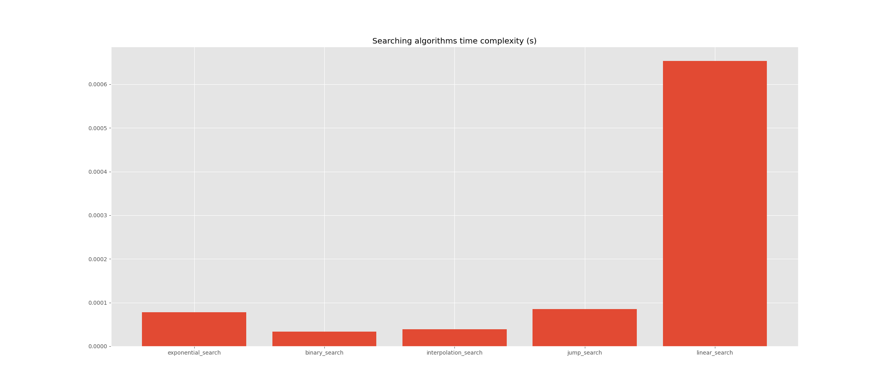

# Searching Algorithm Implementations

<h2>The following algorithms are included:</h2>
<ul>
    <li>Binary</li>
    <li>Exponential</li>
    <li>Interpolation</li>
    <li>Jump</li>
    <li>Linear</li>
</ul>
<h3>Threads and Queues:</h3>

Each searching function is sent to a thread, this way there is no conflict between them, when parallel run occurs.
Each thread puts the result into a Queue object.

