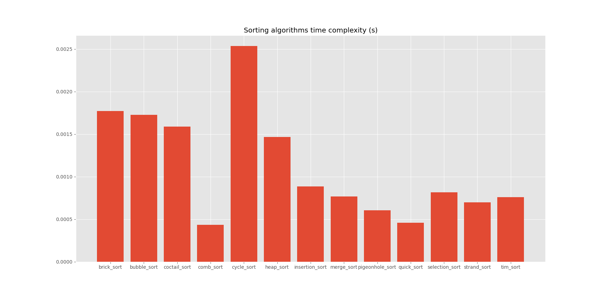

# Sorting Algorithm Implementations

<h2>The following algorithms are included:</h2>
<ul>
    <li>Bogo</li>
    <li>Brick</li>
    <li>Bubble</li>
    <li>Bucket</li>
    <li>Coctail</li>
    <li>Comb</li>
    <li>Counting</li>
    <li>Cycle</li>
    <li>Gnome</li>
    <li>Heap</li>
    <li>Insertion</li>
    <li>Merge</li>
    <li>Pigeonhole</li>
    <li>Quick</li>
    <li>Selection</li>
    <li>Strand</li>
    <li>Tim</li>
</ul>
<h3>Threads and Queues:</h3>

Each sorting function is sent to a thread, this way there is no conflict between them, when parallel run occurs.
Each thread puts the result into a Queue object.

<h3>Note:</h3>

 The <u>Bogo sort</u> algorithm is excluded from the chart, as it generates completely random results, and
usually takes too long to finish. 
The <u>Bucket sort</u> algorithm is excluded from the chart, as it mainly used for lists of floats. 
The <u>Counting sort</u> algorithm is excluded from the chart, as it mainly used for lists of single digit integers.
 

